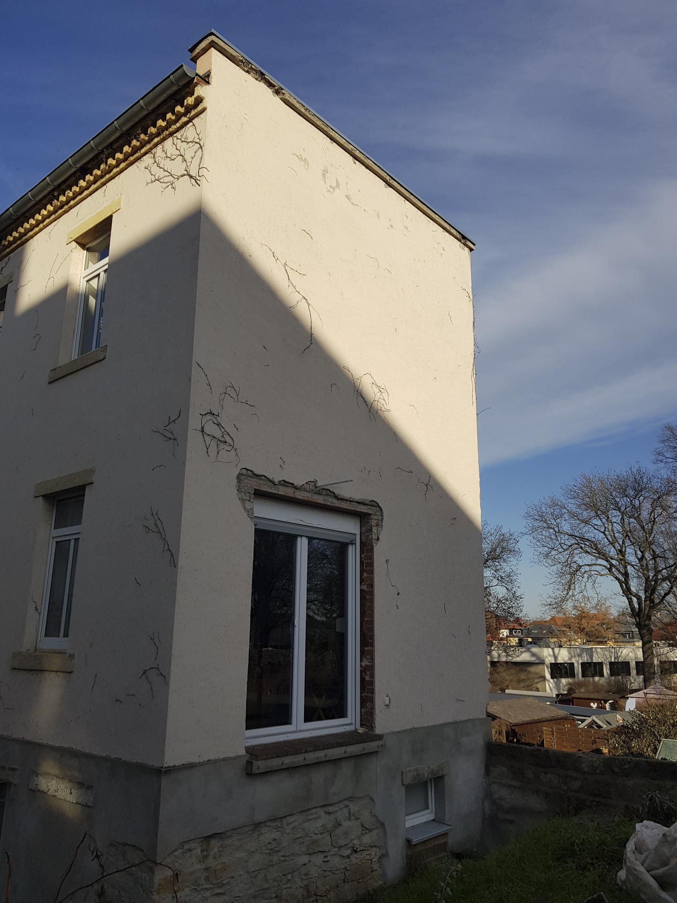

# Montage der PV-Platten

Natürlich gibt es die verschiedensten Möglichkeiten zur Montage der Solarplatten für ein Balkonkraftwerk: auf dem Flach- oder Spitzdach, an der Haus-Fassade - vertikal oder angewinkelt- auf dem Schuppen oder auf der Wiese, am Balkon oder dem Terrassentisch...

Mein Ziel ist es, die zwei Solar-Platten an der Fassade (Süd-Seite) auf einer Metall-Konstruktion zu montieren. Diesen will ich aus Winkelstahl selber bauen.

{:height="400px" width="300px"}.

## Selberbauen oder Fertiges?

Auch hier gilt selbstverständlich, dass man sich mit etwas handwerklichem Geschick, Platz zum Arbeiten und wenig Geld eine Haltung für seine PV-Platten selber bauen kann. Ich beziehe mich hier auf Einzelanfertigungen für PV Balkonkraftwerke.. ;-)
Es ist auch nicht verwerflich, sich etwas fertiges zu kaufen - da gibt es für die verschiedensten Gegebenheiten und Anforderungen diverse Lösungen z. B. bei eBay (siehe Links).

### Links zu Informationen Solarplatten Halterungen

- [Photovoltaik an der Fassade](https://www.solaranlage-ratgeber.de/photovoltaik/photovoltaik-installation/photovoltaik-an-der-fassade)

### Links zu Fertiglösungen PV Halterungen

- [eBay - Photovoltaik Befestigungsmittel](https://www.ebay.de/b/Photovoltaik-Befestigungsmittel/125063)

- [eBay - Solarpanel Halterung bis 1140mm](https://www.ebay.de/itm/295231272124)
- [eBay - Halterung Solarpanel 1180mm](https://www.ebay.de/itm/185509684244)
- [eBay - Halterung Solarpanel 1180mm](https://www.ebay.de/itm/155178307528)
- [Shop photovoltaik4all.de - Fassadenstütze für Solarmodule](https://www.photovoltaik4all.de/schletter-fassadenstuetze-light-fuer-solarmodule-1,3-bis-1,6m)
- [Shop primesolar.eu - Fassaden Halterung für Solarmodule](https://www.primesolar.eu/shop/halterung-fuer-solarmodule-bis-1070-mm-modulbreite/)
