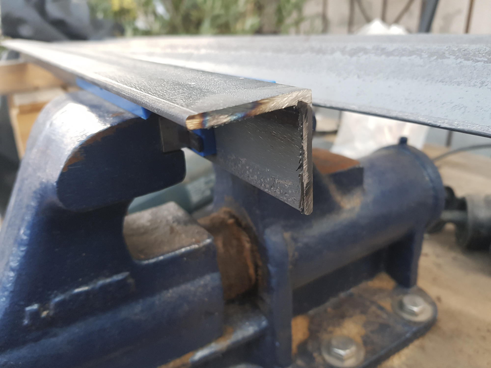

# PV-Platten Halterung aus Winkelstahl (Eigenbau)

{:height="325px" width="400px"}.

{:height="400px" width="383px"}.

{:height="400px" width="383px"}.

Ich werde die Halterung der PV-Module also selbst bauen. Danke an meinen Bruder Kay für die Konstruktions-Tipps.
Die Höhe es deswegen so gewählt, weil die Sonne im Winter tiefer steht und damit der Schatten des Nachbarhauses die Stromproduktion stört. (sieht man ganz gut auf dem Bild in [Montage der PV-Platten](pv-module_montage.md))

## Material

- Winkelstahl 40x40x3 mm
- Maschinenschrauben M8x20
- Muttern selbstsichernd, M8
- Unterlegscheiben, M8
- 6-Kant-Schrauben für Wand: 8 x 100 mm
- Dübel: 10 x 100 mm
- Hammerite Rostschutz

## Werkzeug

- Stift und Winkel zum Anzeichnen
- Winkelschleifer mit Trennscheibe für Metall
- Feile zum Entgraten
- Schablone mit Winkeln
- Schraubzwingen
- Körner
- Bohrmaschine mit Metallbohrern Ø 4, 6 und 8 mm
- Senker HSS Ø 8 mm
- Pinsel 30 mm breit
- Schlagbohrmaschine/ Bohrhammer mit Steinbohrer Ø 10 mm

{ width=400px }

### Arbeitsablauf zur Herstellung der PV Halterungen

Je PV Platte werden zwei aus Winkelstahl gefertigte Dreiecke benötigt.

#### 1. Anzeichnen und Ablängen des Winkelstahls

- wir brauchen drei Stück Winkelstahl auf Länge geschnitten
  - 70 cm
  - 98 cm
  - 120 cm

{ width=400px }
{ width=400px }
{ width=400px }
{ width=400px }
{ width=400px }

- Schneiden mit dem Winkelschleifer
{ width=400px }

#### 2. Entgraten

Mit der Feile werden die Schnittkanten entgratet, damit man sich nicht schneidet.
Auch die Bohrlöcher müssen entgratet werden, damit man sich nicht verletzt und sie nicht reißen.
{ width=400px }
{ width=400px }

#### 3. Bohren und verschrauben

Wenn die Schnittkanten entgratet sind, können die Einzelteile in Position gebracht werden. Darunter legen wir ein Kantholz, in welches wir reinbohren können.
Mit Schraubzwingen werden die Einzelteile befestigt, damit sie sich beim Bohren nicht verschieben.
Es ist ratsam, jedes Loch vorzubohren: erst mit dem 4er, dann mit dem 6er und zum Schluss mit dem 8er Bohrer final.
Nun müssen die Bohrlöcher beidseitig mit dem Senker entgratet werden.

#### 4. Streichen mit Rostschutz (2-fach)

Um den Stahl möglchst lange vor Witterung zu schützen, muss er behandelt werden. Ein zweifaches Streichen mit Rostschutzfarbe sollte reichen.
Dazu muss die Konstruktion vollständig auseinandergebaut werden.
